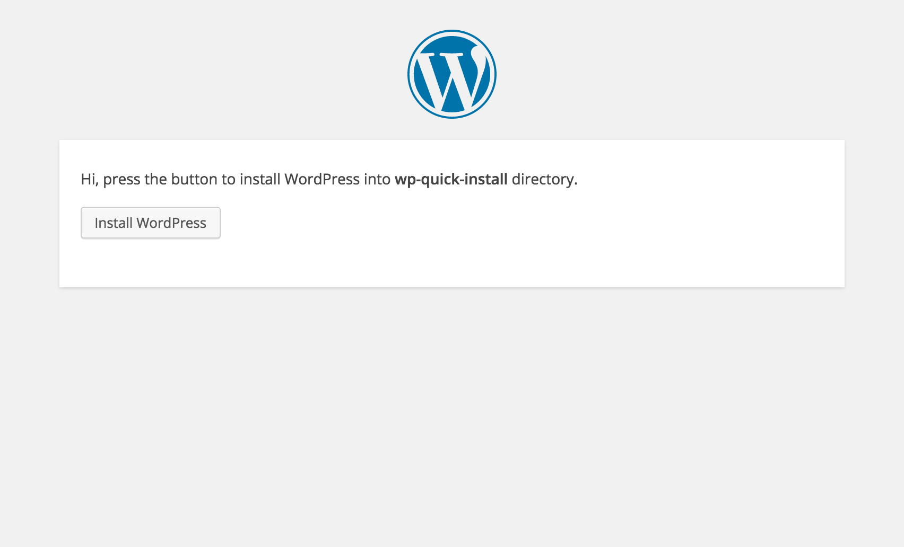

WP Quick Install
================
The easiest way how to install WordPress - one file installer.

Upload index.php and visit from browser.

Instructions
------------
 1. **Upload [index.php](https://raw.githubusercontent.com/pravdomil/WP-Quick-Install/master/index.php) in folder you want have WordPress installed**
 2. Visit the folder from internet browser

Features
--------
 - Create wp-config
 - Choose language
 - Create admin user
 - Set basic site settings
 - Set static front page
 - Set permalink structure
 - Set default avatar
 - Delete default plugins and templates
 - Download, install and activate plugins and themes
 - Create predefined user installer
 - Save configuration in cookie
 - Import/export configuration

Screenshot
----------

Custom config, auto installer
-----------------------------
Open [index.php](index.php) and follow the instructions.
